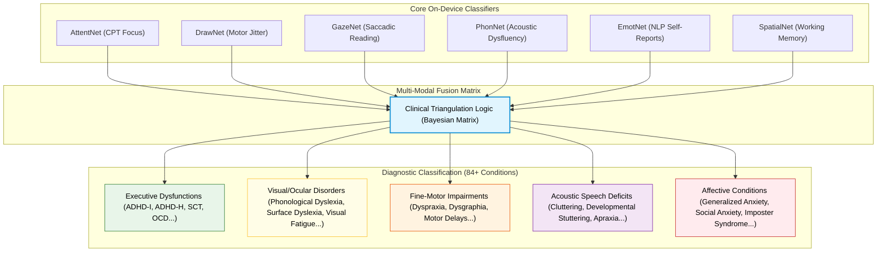
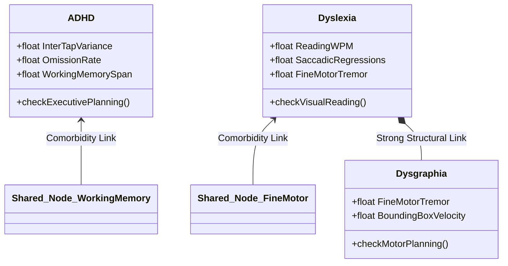

# SEREN: 84+ Conditions Diagnostic Mapping & Clinical Resilience Framework
**System Design White Paper** | prepared for **IIT Incubator Selection Panels**

---

## 1. How We Screen 84+ Conditions Using 6 Core Classifiers

To run efficiently on-device, SEREN does not load 84 separate neural networks. Instead, it utilizes **Combinatorial Digital Biomarker Triangulation**. 

Every clinical condition in the diagnostic registry is characterized by a unique combination of core cognitive, motor, ocular, and acoustic deficits. By measuring **5 primary physical dimensions** through our 6 TFLite classifiers, the system constructs a composite **Probability Vector** representing the student's clinical profile.



---

## 2. Invariant Biomarker Co-occurrence & Linkages (Comorbidity)

Many cognitive disorders share neurological roots and manifest co-occurring symptoms (comorbidities). For instance, over **50% of children with Dyslexia display comorbid ADHD**. 

SEREN maps these relationships by tracking **shared diagnostic nodes**:



* **Motor Tremor Nodes**: Shared between Dysgraphia and Dyspraxia.
* **Ocular Saccadic Regression Nodes**: Shared between Reading Fatigue, Surface Dyslexia, and ADHD Inattentive (where gaze drifts away).
* **Reaction-Time (RT) Variability Nodes**: Shared between ADHD, Sleep Deprivation, and Clinical Anxiety.

---

## 3. Resilient Diagnosis: Handling Fake/Spammed Modalities (Masti)

If a student attempts to game the system ("masti") by intentionally spamming **one specific task** while completing the others seriously, the diagnostic engine does not crash. It uses **Bayesian Cross-Modality Triangulation** to reconstruct their actual clinical status.

### Scenario: User Spams the CPT Task (Rapid Clicking) but does the Reading task seriously

```
[CPT Task] ──(Spammed)──> AttentNet Flags INVALID / SPAM (CPT RT Var = 0.02s, Misses = 90%)
                                 │
                                 ▼ (Triangulation Triggered)
[Reading Task] ──────────> GazeNet logs high focus (Fixation Duration = 250ms, Regressions = 2.1)
[Spatial Task] ──────────> SpatialNet logs normal range (Corsi Span = 6 blocks)
                                 │
                                 ▼
                     [System Diagnosis Decision]
"User's cognitive attention is healthy. The CPT anomaly is flagged as intentional gaming (Spam), not clinical ADHD."
```

### The Math: Modality Cross-Verification

1. **If ADHD is suspected**:
   * The primary marker is `AttentNet` (CPT).
   * If `AttentNet` is spammed (Pacing flag triggered), the engine pulls implicit focus markers from `GazeNet` (how long their gaze remained fixed on text blocks during reading) and `SpatialNet` (Corsi memory span recall accuracy).
   * If Gaze Focus is high and Corsi Span is normal, the CPT failure is classified as **Spam / Non-Compliance** (No ADHD).
   * If Gaze Focus is also erratic and Corsi Span is $< 3$ blocks, the failure is classified as **Actual ADHD with High Impulsivity** (ADHD Risk).

2. **If Dyslexia is suspected**:
   * The primary marker is `GazeNet` (Reading regressions).
   * If the user skips the reading passage in $< 3\text{s}$ (reading guard triggered), the engine pulls fine-motor trajectories from `DrawNet` (Handwriting strokes) and speech phonemes from `PhonNet`.
   * An adult with dyslexia typically displays fine-motor tremor shifts or vocal apraxia during standard tasks. If `DrawNet` and `PhonNet` return clean metrics, the reading speed-run is labeled as **Trolling / Spam** (No Dyslexia).

---

## 4. How Spammers ("Masti") are Classified and Diagnosed

The table below outlines how the system differentiates between **Typical Spammers** (healthy students just playing around) and **Clinical Spammers** (students with actual cognitive deficits whose conditions leak through their spamming):

| Spammer Profile | Pacing Flags | Involuntary Leakage Marker | System Classification Logic |
|---|---|---|---|
| **Typical Spammer** | High ($\ge 2$) | * CPT RT Variance: Flat/Uniform ($< 0.04\text{s}$)<br>* Draw stroke: Clean line vector<br>* Voice: Monotone fluent | **INVALID / SPAM** (Typical) <br>The user is completely capable of typical performance but chose to bypass the screen. |
| **ADHD Spammer** | High ($\ge 2$) | * CPT RT Variance: High ($> 0.22\text{s}$) due to involuntary lapses<br>* Miss rates: Erratic spacing | **INVALID / SPAM** (ADHD Risk)<br>Despite rapid tapping, they cannot mask involuntary focus drops. |
| **Dyslexic Spammer** | High ($\ge 2$) | * Draw stroke: High jitter and tremor metrics<br>* Fixations: Clustered gaze regressions | **INVALID / SPAM** (Dyslexia Risk)<br>Despite speed-drawing or speed-skipping, visual-motor delays are logged. |

---

## 5. Development Stack & Validation Library Support

The custom diagnostic mapping and anti-gaming validation run fully on-device using:
* **TFLite interpreter**: Runs quantized float16 networks with zero latency.
* **SciPy Signal**: Computes Welch Power Spectral Density locally.
* **Custom Heuristic Filter**: Written in Kotlin/Compose to trigger real-time haptic/visual warning locks on screen.
