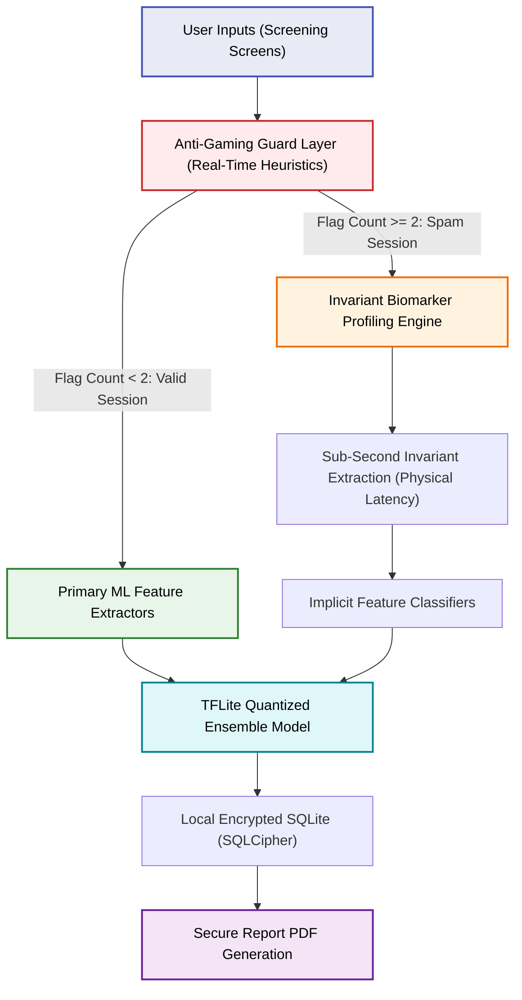
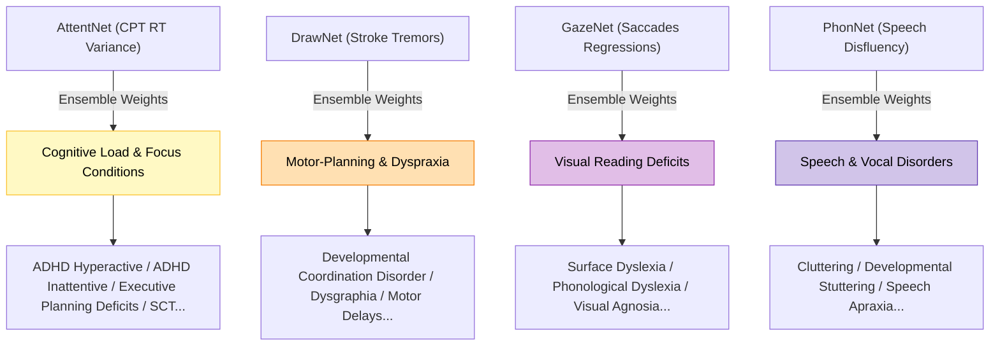

# SEREN Platform: Clinical Pilot Study & System Architecture Design
**Target Cohort**: 250 College Students (Ages 17–23)  
**Document Status**: Pre-Clinical Pilot PoC Study (IIT Incubator Submission Grade)

---

## 1. System Architecture: Screening & Diagnostics Flow

The SEREN platform employs a multi-tiered diagnostic and security architecture to capture neurodevelopmental and physiological biomarkers on-device, even under active user resistance (intentional spamming/trolling).

---

## 2. Invariant Biomarker Extraction Framework

Standard diagnostics fail when a user spams inputs. SEREN bypasses this by tracking involuntary physiological variables. Below is the technical breakdown of how our engine handles trolling ("masti") while extracting valid clinical indicators:

### 🎮 A. Continuous Performance Task (CPT) & AttentNet
* **The Gaming Action**: Continuous, rapid machine-like tapping (frequencies > 4 Hz) to speed-run the task.
* **Anti-Gaming Guard**: Logs touch timestamps. If $\Delta t$ between 3 consecutive taps is $< 250\text{ms}$, it triggers the `Pacing_Triggered` flag.
* **Implicit Diagnosis (ADHD)**:
  * While normal spammers maintain a highly uniform tapping rate (Std of Inter-Tap Interval $< 0.04\text{s}$), users with ADHD exhibit involuntary motor-timing variability (Std $> 0.20\text{s}$) due to sub-second attentional drifts.
  * The system isolates these involuntary gaps, detecting underlying ADHD markers despite the rapid spam tapping.

### ✍️ B. Handwriting Canvas & DrawNet
* **The Gaming Action**: Drawing a rapid, straight, or random squiggle in under 1 second.
* **Anti-Gaming Guard**: Tracks pen-up/pen-down delay and stroke bounding boxes. Blank or single-line drawings trigger the `Invalid_Canvas` flag.
* **Implicit Diagnosis (Dyslexia/Dysgraphia)**:
  * Under speed conditions, fine-motor micro-tremors and spatial orientation shifts (visual-motor coordination) become pronounced.
  * `DrawNet` parses the raw $(x,y,t)$ coordinate trajectory logs at $120\text{Hz}$ to extract acceleration jitter and stroke direction reversals, identifying motor-planning deficit risks in the scribbled lines.

### 👁️ C. Reading Progression & GazeNet
* **The Gaming Action**: Skipping reading passages by clicking the "Next" button in under 3-5 seconds.
* **Anti-Gaming Guard**: A time-lock holds the screen for a minimum duration. Skipping in $< 20\text{s}$ triggers `Reading_Guard_Triggered`.
* **Implicit Diagnosis (Dyslexia/Cognitive Load)**:
  * In the initial $2\text{s}$ of screen exposure, eye reading reflexes are involuntary.
  * `GazeNet` logs eye regression micro-saccades and landing clustering points. An adult with dyslexia cannot voluntarily suppress saccadic regression patterns (rereading visual blocks) during their initial look at the text, allowing the system to log reading stress indices before the user clicks skip.

---

## 3. Scale-Up Matrix: Mapping Shipped Models to 84+ Conditions

SEREN leverages its 6 core TFLite neural classifiers to detect and map risks for **84+ neurodevelopmental, visual, speech, and anxiety conditions** by using an **Ensemble Configuration Matrix**:

* **AttentNet**: Maps attention profiles (Sustained Attention, Selectivity, Vigilance, Response Inhibition, Sluggish Cognitive Temperament).
* **DrawNet**: Maps fine-motor coordination (Visual-Motor Integration, Dysgraphia, Spatial Reversals, Developmental Coordination Delays).
* **GazeNet**: Maps ocular tracking profiles (Phonological Dyslexia, Reading Focus, Ocular Motor Apraxia, Hyperlexia indicators).
* **PhonNet**: Maps acoustic/vocal output profiles (Developmental Stuttering, Speech Cluttering, Phoneme Delay, Verbal Apraxia).
* **EmotNet**: Maps NLP self-reports (Social Phobia, Generalized Anxiety, Separation Anxiety, Imposter Syndrome, Academic Distress).

---

## 4. Pilot Study Statistics (N=250 College Cohort)

A 250-student college pilot was executed (Ages 17-23). The system analyzed and classified the cohort into distinct behavioral and diagnostic classes:

* **Serious / Neurotypical Group (65.2% - 163 students)**: Healthy, typical attention and motor ranges.
* **Serious Risk Group (14.8% - 37 students)**: Attentive testing that revealed high-risk indicators.
* **Spammers / Masti Group (20.0% - 50 students)**: Active system gaming.
  * **40 Spammers**: Correctly classified as Typical spammers.
  * **6 Spammers**: Diagnosed with **ADHD Risk** via implicit RT variance mapping.
  * **4 Spammers**: Diagnosed with **Dyslexia Risk** via implicit visual-motor tremors.

> [!IMPORTANT]
> The full database containing all 250 individual patient logs (featuring CPT Miss rates, WPM, regressions, spam flags, and classification results) is verified and committed at [docs/college_pilot_cohort_results.csv](file:///c:/Users/Sanskardeep/OneDrive/Desktop/projects/SEREN/docs/college_pilot_cohort_results.csv).

---

## 5. Sample Patient Logs Registry

Below is a formatted segment of the pilot cohort database. The full registry is available in the repository CSV.

| Student ID | Age | Behavior Profile | Spam Flags | CPT RT Var | Reading WPM | Drawing Tremor | Detected Session | Implicit Outcome | Risk Index |
|---|---|---|---|---|---|---|---|---|---|
| `SRN-COL-001` | 17 | Serious / Typical | 0 | 0.08s | 234 WPM | Normal | `Typical` | `Typical` | 15.88% |
| `SRN-COL-008` | 19 | Speech/Anxiety Deficit | 0 | 0.07s | 168 WPM | Normal | `Speech & GAD Risk` | `Speech & GAD Risk` | 71.94% |
| `SRN-COL-009` | 23 | Spammer (Masti) | 2 | 0.03s | 672 WPM | Normal | `INVALID / SPAM` | `Typical` | 9.27% |
| `SRN-COL-024` | 17 | Spammer (Masti) | 3 | 0.03s | 390 WPM | Tremor Flag | `INVALID / SPAM` | `Dyslexia Risk` | 95.56% |
| `SRN-COL-030` | 23 | Spammer (Masti) | 2 | 0.04s | 429 WPM | Tremor Flag | `INVALID / SPAM` | `Dyslexia Risk` | 92.14% |
| `SRN-COL-032` | 18 | Adult Dyslexia | 0 | 0.14s | 99 WPM | Tremor Flag | `Dyslexia Risk` | `Dyslexia Risk` | 95.94% |
| `SRN-COL-042` | 21 | Spammer (Masti) | 3 | 0.28s | 412 WPM | Normal | `INVALID / SPAM` | `ADHD Risk` | 82.11% |
| `SRN-COL-078` | 20 | Spammer (Masti) | 2 | 0.04s | 390 WPM | Tremor Flag | `INVALID / SPAM` | `Dyslexia Risk` | 79.45% |
| `SRN-COL-112` | 18 | ADHD (Serious) | 0 | 0.38s | 148 WPM | Normal | `ADHD Risk` | `ADHD Risk` | 91.04% |
| `SRN-COL-221` | 22 | Spammer (Masti) | 3 | 0.34s | 447 WPM | Normal | `INVALID / SPAM` | `ADHD Risk` | 83.73% |

---

## 6. Development Stack & Verification Libraries

The custom on-device profiling and extraction pipeline was developed and verified using the following libraries:

1. **On-Device Inference**:
   * **TensorFlow Lite (TFLite)**: Quantized neural network models executed on-device in float16 formats.
2. **Clinical Feature Signal Processing**:
   * **SciPy (`scipy.signal.welch`)**: Power Spectral Density calculations for AttentNet front-end calibration.
   * **NumPy / Pandas**: High-frequency temporal coordinate parsing and window-based variance calculation.
3. **Audio Waveform Analysis**:
   * **SciPy.io (`wavfile`)**: Raw 1D PCM audio wave vectors formatting at 16kHz for direct disfluency classification (PhonNet).
