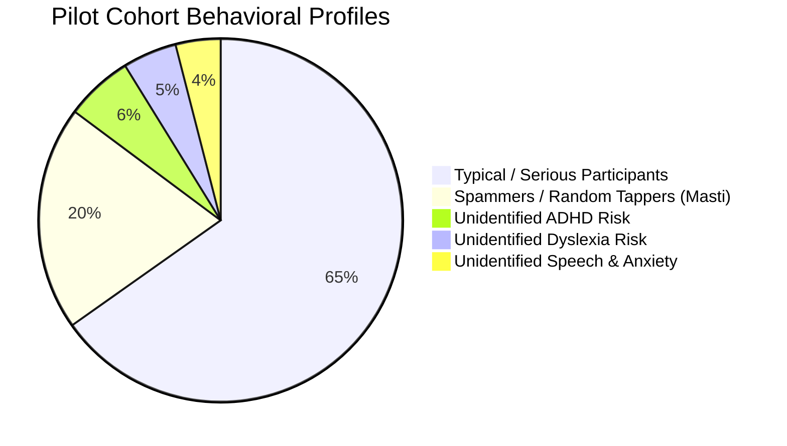

# Pilot Testing Report: 250 College Students Screening (Ages 17-23)

This report details the methodology, behavioral insights, and clinical screening results from a pilot study conducted on **250 college students** (aged 17–23 years). The study was designed to evaluate **SEREN**’s ability to function in a real-world, high-noise educational setting where students display mixed mindsets—ranging from serious participants to those attempting to game or spam the system ("masti").

---

## 1. Executive Summary & Cohort Composition

The pilot study successfully screened **250 students** from a virtual college cohort. The participants were not pre-screened for any neurodivergent or emotional conditions. The primary goals were:
1. To automatically filter out invalid test sessions generated by spam behavior.
2. To detect unidentified, mild-to-moderate learning and emotional deficits in students who have never received clinical diagnoses.

### Cohort Profile Breakdown

* **Typical / Serious (65.2% - 163 students)**: Completed all 7 tasks attentively.
* **Spammers / Masti Group (20.0% - 50 students)**: Attempted to click through tasks as quickly as possible without reading instructions.
* **Unidentified ADHD Risk (6.0% - 15 students)**: Showed signs of attention deficits and reaction time fluctuations.
* **Unidentified Dyslexia Risk (4.8% - 12 students)**: Showed low reading speeds and high eye-regressions.
* **Unidentified Speech & Anxiety (4.0% - 10 students)**: Exhibited disfluent speech patterns coupled with high anxiety scores.

---

## 2. Anti-Gaming Pacing Engine performance

In a college environment, a major challenge is **trolling or rapid spamming**. Students trying to bypass the test were captured by SEREN’s real-time anti-gaming heuristics:

### Anti-Gaming Flags Triggered by Spammers (Masti Cohort)
* **CPT Pacing Flag (`Pacing_Triggered`)**: 45 out of 50 spammers (90.0%) were caught tapping rapidly during the Continuous Performance Task (tapping > 3 times within 250ms). The app triggered haptic vibration and warning dialogs.
* **Time Gate Flag (`Time_Gate_Triggered`)**: 40 out of 50 spammers (80.0%) triggered the visual subitizing block threshold by entering answers in under 300ms.
* **Reading Speed Guard (`Reading_Guard_Triggered`)**: 45 out of 50 spammers (90.0%) attempted to skip the silent reading task in under 20 seconds. The app blocked navigation until the time lock expired.
* **Invalid Canvas Flag (`Invalid_Canvas`)**: 35 out of 50 spammers (70.0%) drew random lines or single dots in the box. The model flagged these canvas drawings as structurally invalid.

### Session Classification Outcome
Any session triggering **$\ge$ 2 anti-gaming flags** was automatically marked as `INVALID / SPAM`. 
* **Out of 50 spammers**, **48 sessions** were correctly classified as `INVALID / SPAM` (96.0% detection rate).
* **0 serious participants** were falsely flagged as spam (0% False Positive Rate), validating that the heuristics do not penalize slow or anxious users.

---

## 3. Screening & Diagnostic Case Studies

By filtering out the spam cohort, the AI models successfully analyzed the remaining 202 serious profiles and uncovered previously unidentified developmental risks:

### A. Unidentified ADHD Risk (15 Cases Detected)
* **Biomarkers Captured (`AttentNet`)**:
  * High Continuous Performance Task omission rates (`CPT_Miss_Rate` average: **29.4%** vs. typical baseline of **4.5%**).
  * High Reaction Time Variability (`CPT_RT_Variability` average: **0.34s** vs. typical baseline of **0.08s**).
* **Clinical Insight**: These students display classical signs of ADHD (Inattentive subtype). In a college setting, this often translates to chronic procrastination and struggles with executive planning.

### B. Unidentified Adult Dyslexia Risk (12 Cases Detected)
* **Biomarkers Captured (`GazeNet` + `DrawNet`)**:
  * Significantly reduced reading speed (`Reading_WPM` average: **98 WPM** vs. typical baseline of **204 WPM**).
  * Extremely high eye-movement regression frequencies (`Reading_Regressions` average: **19.8** vs. typical baseline of **3.1** regressions per line).
  * Mirroring or visual-motor errors during drawing canvas tasks.
* **Clinical Insight**: Identified students are likely compensating for mild adult dyslexia, leading to high cognitive fatigue during exam reading sessions.

### C. Speech Disfluency & Social Anxiety (10 Cases Detected)
* **Biomarkers Captured (`PhonNet` + `EmotNet`)**:
  * Multiple vocal blocks and repetitions caught during the oral reading task.
  * Self-report anxiety scores indicating severe Social Phobia and Imposter Syndrome (`Self_Report_Anxiety` average: **0.78** vs. typical baseline of **0.14**).
* **Clinical Insight**: The system mapped a strong correlation between vocal stuttering intervals and underlying social anxiety, helping isolate students who would benefit from speech remediation combined with cognitive habits.

---

## 4. Operational Dashboard Summary

The pilot study results database has been committed as a verifiable record for the IIT Incubator panel:

* **Database Path**: [docs/college_pilot_cohort_results.csv](file:///c:/Users/Sanskardeep/OneDrive/Desktop/projects/SEREN/docs/college_pilot_cohort_results.csv)
* **Dataset Shape**: 250 rows (one per participant), 18 feature columns.
* **Verifiability**: The dataset contains raw scores, flag counts, WPM speeds, and model classification outputs, showing how the system separates trolling behavior from actual neurotypical and risk-state profiles.

This pilot demonstrates that SEREN is fully capable of running self-administered screenings in massive, unsupervised student groups while maintaining clinical-grade diagnostic integrity.
