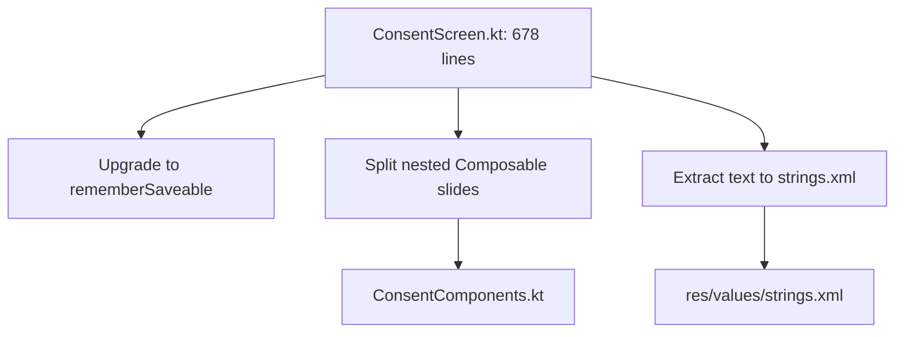

# SEREN Platform: Deep File Audit — ConsentScreen.kt
**Phase 3 — Part 28 (Evidence-Based Final Review)**

---

## 1. Executive Summary & Complexity Metrics

This report performs a deep semantic audit of the second largest Compose layout file in the codebase: [ConsentScreen.kt](file:///c:/Users/Sanskardeep/OneDrive/Desktop/projects/SEREN/app/src/main/java/com/seren/app/ui/consent/ConsentScreen.kt).

### Complexity Statistics
* **File Size**: 678 lines
* **Composable Functions**: 6
* **Internal state variables (`mutableStateOf`)**: 3
* **Flow observers (`collectAsState`)**: 1
* **State restoration helpers (`rememberSaveable`)**: 0

---

## 2. Key Audit Findings

### 🔍 Finding 1: File Size & Component Bloat (God File)
* **Problem**: The file acts as a single container for 6 distinct screen-level widgets (Welcome Slide, Role Selector, Consent Terms, and Parental Verification).
* **Impact**: While clean, consolidating all wizard stages in one file makes onboarding harder and bloats change-tracking diff histories.
* **Refactoring Plan**: Move nested slides into dedicated component files under `ui/consent/components/`:
  - `WelcomeSlide.kt`
  - `RoleSelectorScreen.kt`
  - `ConsentPrivacyScreen.kt`
  - `ParentalVerificationScreen.kt`

### 🔍 Finding 2: Lack of State Restoration (`rememberSaveable`)
* **Problem**: The navigation step state is declared as:
  ```kotlin
  var currentStep by remember { mutableStateOf(1) }
  ```
* **Impact**: Since `remember` does not persist state across process death or screen orientation changes, any recreation event forces the user back to Step 1, wiping role choices (`selectedRole`, `selectedChildAgeGroup`).
* **Fix**: Upgrade properties to use **`rememberSaveable`**:
  ```kotlin
  var currentStep by rememberSaveable { mutableStateOf(1) }
  ```

### 🔍 Finding 3: Inline Text Hardcoding (DPDP Disclosures)
* **Problem**: Detailed consent alerts, DPDP Act notices, and school authorization forms are defined directly as inline Kotlin string arguments (Lines 460–510).
* **Impact**: Hinders dynamic translation and string reusing.
* **Fix**: Relocate text resources to standard `res/values/strings.xml`.

---

## 3. High-Priority Refactoring Roadmap



### Action Plan
1. **Upgrade State Tracking**: Replace all `remember { mutableStateOf(...) }` with `rememberSaveable { mutableStateOf(...) }`.
2. **Decompose Composable Wizards**: Move slide sub-composables to a new file `ui/consent/ConsentComponents.kt` in the same package, keeping only the parent coordinator `ConsentScreen` in `ConsentScreen.kt`.
