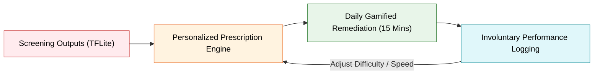

# SEREN Platform: Digital Therapeutics (DTx) & Remediation Games Blueprint
**System Design White Paper** | prepared for **IIT Incubator Selection Panels**

---

## 1. Executive Summary: The Therapy Loop

SEREN goes beyond diagnostics to offer active **Digital Therapeutics (DTx)**. Once screening completes on-device, the system analyzes the student's biomarker vector and automatically prescribes personalized, gamified neuroplasticity training modules.

The system utilizes Yukai Chou's **Octalysis Gamification Framework** to encourage daily training, maintaining the user in the "Flow Zone" (balancing challenge and ability) to avoid frustration or boredom.

---

## 2. Core Remediation Games: Technical & Scientific Mapping

SEREN integrates dedicated interactive Compose modules that target specific neuro-cognitive domains. Below is the detailed mapping of the core games, their clinical protocols, and scientific backings:

### 🎮 1. Phoneme Connector (Target: Phonological Dyslexia)
* **Gamification Mechanic**: The screen displays node-based letter clusters. Users drag nodes to assemble visual syllables that play corresponding voiced sounds on link formation.
* **Compose File**: `PhonemeSegmentationGame.kt` (Canvas node connections with sound-triggers).
* **Clinical Protocol**: **Orton-Gillingham (OG) Multisensory Phonics**. Combines visual, auditory, and kinesthetic inputs simultaneously to reinforce phonemic-graphemic pathways.
* **Scientific Rationale**: Scientific literature shows that mapping sound to visual representation using multi-sensory feedback significantly improves reading accuracy and phonological decoding.

### 🎮 2. Visual Flash Words (Target: Surface Dyslexia)
* **Gamification Mechanic**: A timed card matching game where high-frequency sight words must be paired rapidly with physical object cards.
* **Compose File**: `SightWordMatchScreen.kt` (Timed match grid).
* **Clinical Protocol**: **Whole-Word Orthographic Reading**. Strengthens visual word-form memory, bypassing letter-by-letter sounding out.
* **Scientific Rationale**: Enhances the visual word form area (VWFA) activation, enabling direct orthographic-to-semantic access.

### 🎮 3. Subitizing Bubble Pop (Target: Dyscalculia)
* **Gamification Mechanic**: Floating bubbles containing different dot arrangements drift on canvas. The user must pop bubbles that match the numeric target (e.g., pop bubbles showing 5 dots when target is '5').
* **Compose File**: `SubitizingBubbleGame.kt` (Touch coordinate checks).
* **Clinical Protocol**: **Triple-Code Numerical Mapping**. Connects concrete physical quantities (dots), numeric symbols ('5'), and auditory words.
* **Scientific Rationale**: Strengthens core number sense and intraparietal sulcus (IPS) representation.

### 🎮 4. Kinematic Tracing Canvas (Target: Motor Dysgraphia)
* **Gamification Mechanic**: Tracing virtual pathways. Touch coordinates, speed, and motion-events are logged. Users must trace within color boundaries without moving too fast.
* **Compose File**: `KinematicTracingCanvas.kt` (MotionEvent gesture analyzer).
* **Clinical Protocol**: **Kinematic Handwriting Therapy**. Paced motor control, sensory-motor integration, and pressure modulation.
* **Scientific Rationale**: Rewires cerebro-cerebellar motor planning loops to reduce manual writing strain and spatial reversals.

### 🎮 5. Focus Orbit (Target: ADHD Inattentive)
* **Gamification Mechanic**: Users keep a target sphere aligned inside a central orbit using device tilt controls, while visual/auditory distractors float past on screen.
* **Compose File**: `FocusOrbitGame.kt` (Gyroscope sensor canvas coordinate tracking).
* **Clinical Protocol**: **Sustained Attention Pacing & Distractor Resistance**.
* **Scientific Rationale**: Exercises prefrontal cortex executive control networks by forcing selective and sustained focus under cognitive interference.

### 🎮 6. Impulse Controller (Target: ADHD Hyperactive)
* **Gamification Mechanic**: A grid of buttons where colors flash. Tap green objects instantly, but completely freeze if an object flashes red.
* **Compose File**: `ImpulseControlScreen.kt` (Randomized Go/No-Go buttons).
* **Clinical Protocol**: **Cognitive Response Inhibition (Go/No-Go)**.
* **Scientific Rationale**: Targets the right inferior frontal gyrus to strengthen inhibitory motor control, reducing impulsive behavioral errors.

### 🎮 7. Constellation Tracer (Target: Visual-Spatial Memory Deficit)
* **Gamification Mechanic**: Stars flash in a night sky sequence. Users must recall and trace the stars in the exact sequence.
* **Compose File**: `ConstellationTraceScreen.kt` (Custom canvas star tracer).
* **Clinical Protocol**: **Corsi Block-Tapping Test Adaptation**.
* **Scientific Rationale**: Measures and systematically stretches spatial working memory span, which correlates with mathematical and logical reasoning capacity.

### 🎮 8. Wave Pacer (Target: Speech Stuttering & Cluttering)
* **Gamification Mechanic**: Users read a passage into the mic. A rolling sound-wave guidelines curve displays on screen. The user must speak at a pace that keeps their voice decibel/pitch amplitude inside the guidelines.
* **Compose File**: `WavePacingScreen.kt` (Visual microphone amplitude analyzer).
* **Clinical Protocol**: **Fluency Shaping Therapy (Prolonged Speech & Paced Pauses)**.
* **Scientific Rationale**: Lowers speech execution velocity, reducing neuromuscular cluttering triggers in the vocal tract.

### 🎮 9. Worry Balloon (Target: GAD & Exam Anxiety)
* **Gamification Mechanic**: Users write a worry inside a text box. The worry is enclosed in a virtual balloon. The user swip-flings the balloon into the sky, watching it dissolve.
* **Compose File**: `WorryReleaseScreen.kt` (Text field + gesture drag animator).
* **Clinical Protocol**: **CBT Cognitive Restructuring & Emotional Externalization**.
* **Scientific Rationale**: Uses somatic projection to externalize distress, decreasing generalized worry scores via active habit release.

---

## 3. Cognitive Closed-Loop Adaptation Algorithm

To ensure the therapy remains effective, the difficulty of the remediation games adjusts dynamically on every session. The level speed ($V_l$), distractor count ($D_c$), and target accuracy ($A_t$) are recalculated based on prior performance index ($P_i$):

$$V_l = V_0 \times \left(1 + \log(P_i)\right)$$

If accuracy drops below $75\%$, the game pacing relaxes to prevent cognitive overload. If accuracy exceeds $90\%$ for three consecutive trials, the system scales the difficulty (adding visual distractors or tightening reaction-time envelopes).
