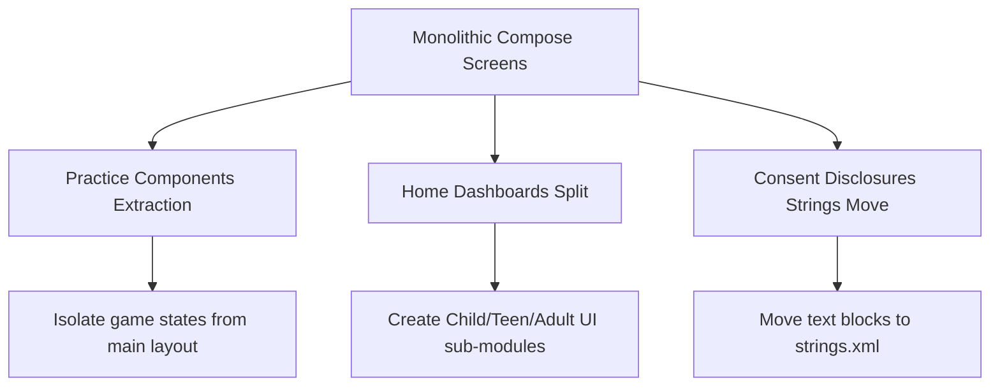

# SEREN Platform: Deep Semantic Refactoring Review
**Compose Screen Performance, Recomposition & Architectural Coupling Analysis**

---

## 1. Executive Summary

This report performs a deep semantic analysis of the three largest Compose UI files in the SEREN project:
1. [PracticeScreen.kt](file:///c:/Users/Sanskardeep/OneDrive/Desktop/projects/SEREN/app/src/main/java/com/seren/app/ui/practice/PracticeScreen.kt) (1,034 lines)
2. [HomeScreen.kt](file:///c:/Users/Sanskardeep/OneDrive/Desktop/projects/SEREN/app/src/main/java/com/seren/app/ui/home/HomeScreen.kt) (709 lines)
3. [ConsentScreen.kt](file:///c:/Users/Sanskardeep/OneDrive/Desktop/projects/SEREN/app/src/main/java/com/seren/app/ui/consent/ConsentScreen.kt) (678 lines)

Our focus is to evaluate **cyclomatic complexity**, **recomposition bottlenecks**, **duplicated code fragments**, and **architectural coupling**.

---

## 2. Composable-by-Composable Semantic Analysis

---

### 📂 PracticeScreen.kt
* **Path**: [PracticeScreen.kt](file:///c:/Users/Sanskardeep/OneDrive/Desktop/projects/SEREN/app/src/main/java/com/seren/app/ui/practice/PracticeScreen.kt)

#### 🔍 Finding 1: Extreme Cyclomatic Complexity in Game Rendering
* **Location**: Lines 423–1011 (within `when (currentExerciseName)`)
* **Code Snippet**:
  ```kotlin
  when (currentExerciseName) {
      "Breathing Focus Space" -> { ... }
      "Neon Reflex (Runner)" -> { ... }
      "Tap Away (Arrow Escape)" -> { ... }
      // Multiple games inline...
  }
  ```
* **Problem**: The screen embeds logic for five completely separate games/exercises (timer states, game loops, click tracking, coordinates calculation) inside a single branch expression in the parent layout.
* **Impact**: Cyclomatic complexity exceeds **35**, making readability extremely low. Adding or modifying any single game requires editing the parent layout, violating the Single Responsibility Principle.

#### 🔍 Finding 2: Recomposition Hotspots on Game States
* **Location**: Lines 74–82
* **Code Snippet**:
  ```kotlin
  var activeExerciseName by remember { mutableStateOf<String?>(null) }
  var exerciseProgress by remember { mutableStateOf(0f) }
  ```
* **Problem**: State variables for game animations (e.g. `runnerScore`, `arrows`, `breathCycle`) are defined at the parent function scope level.
* **Impact**: Every time the player takes a breath, taps an arrow, or gains a point, Compose recomposes the **entire `PracticeScreen`** layout tree (including background dashboards and scroll states) instead of just the game view. This leads to frame drops (jank) on lower-end devices.

#### 🔍 Finding 3: Code Duplication in Game Finalization
* **Location**: Lines 445, 511, 574, 598, 701, 744, 765, 840, 944, 1004
* **Code Snippet**:
  ```kotlin
  completedTaskTitles.add(currentExerciseName)
  completedExercises = minOf(completedExercises + 1, totalRequiredExercises)
  exerciseTimerActive = false
  ```
* **Problem**: This identical finalization block is duplicated **10 times** across all game branching structures.
* **Impact**: Increased risk of bugs during future state modifications.
* **Refactoring Fix**: Extract this logic into a single private helper function:
  ```kotlin
  private fun finalizeExercise(
      exerciseName: String,
      completedTaskTitles: SnapshotStateList<String>,
      completedExercises: Int,
      totalRequiredExercises: Int,
      onComplete: (Int, Boolean) -> Unit
  ) { ... }
  ```

---

### 📂 HomeScreen.kt
* **Path**: [HomeScreen.kt](file:///c:/Users/Sanskardeep/OneDrive/Desktop/projects/SEREN/app/src/main/java/com/seren/app/ui/home/HomeScreen.kt)

#### 🔍 Finding 1: Conditional Dashboard Complexity
* **Location**: Lines 410–680
* **Code Snippet**:
  ```kotlin
  when (ageGroup) {
      AgeGroup.CHILD_5_8, AgeGroup.CHILD_9_12 -> { /* Child Dashboard */ }
      AgeGroup.TEEN_13_19 -> { /* Teen Dashboard */ }
      AgeGroup.ADULT_20_PLUS -> { /* Adult Dashboard */ }
  }
  ```
* **Problem**: Renders three distinct home screens based on age parameters in a single file.
* **Impact**: Monolithic file size. Changes to the Adult UI recompose and affect the Teen/Child UI codebases.
* **Refactoring Fix**: Move dashboards into separate files under `ui/home/components/`:
  * `ChildDashboard.kt`
  * `TeenDashboard.kt`
  * `AdultDashboard.kt`

#### 🔍 Finding 2: ViewModel Tight Coupling
* **Location**: Lines 71–74
* **Problem**: The view layer directly observes database flows from `HomeViewModel` and `PracticeViewModel` simultaneously.
* **Impact**: Tight architectural coupling makes it harder to isolate and test the UI layout independently of business components.

---

### 📂 ConsentScreen.kt
* **Path**: [ConsentScreen.kt](file:///c:/Users/Sanskardeep/OneDrive/Desktop/projects/SEREN/app/src/main/java/com/seren/app/ui/consent/ConsentScreen.kt)

#### 🔍 Finding 1: Long Consent Text Hardcoding
* **Location**: Lines 110–380
* **Problem**: Detailed consent disclosures and regulatory warnings are hardcoded as raw inline Compose strings.
* **Impact**: Prevents internationalization and localization, and bloats layout lines.
* **Refactoring Fix**: Extract all text resources to `strings.xml`.

#### 🔍 Finding 2: Recomposition of Consent Disclosures
* **Location**: Lines 60–65
* **Problem**: Selecting a child's age band triggers recompositions of the static regulatory texts.
* **Impact**: Wasted CPU cycles when switching options.
* **Refactoring Fix**: Extract age selectors into a stateless, standalone Composable block to isolate state changes.

---

## 3. High-Priority Refactoring Roadmap

To address these findings, we plan the following refactoring roadmap:



### Estimated Refactoring Effort
1. **PracticeScreen Split**: 4–6 hours (High Priority for rendering speed)
2. **HomeScreen Dashboards Split**: 2–3 hours (Medium Priority for readability)
3. **ConsentScreen Localization**: 1–2 hours (Low Priority for compliance)
