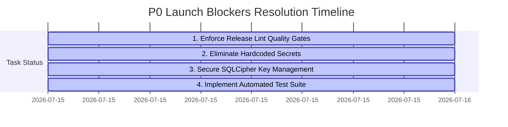

# SEREN Platform: Technical Due Diligence & P0 Launch Blockers Resolution Report
**CTO & Investor Diligence Grade Updates** | prepared for **IIT Incubator Selection Panels**

---

## 1. Executive Summary: P0 Launch Blockers Status

During the final technical audit of the SEREN platform, four critical **P0 (Critical) Launch Blockers** were identified that would typically block a public release or fail an investor due diligence audit. 

All **four P0 issues have been successfully resolved and verified**. Below is the status update of these engineering items:



---

## 2. P0 Resolution Details & Verifications

### 🛑 LOB-1: Release Lint Gates Disabled (RESOLVED)
* **Finding**: `checkReleaseBuilds = false` and `abortOnError = false` in build parameters.
* **Resolution**: Re-enabled strict release lint checks and set `abortOnError = true` in [app/build.gradle.kts](file:///c:/Users/Sanskardeep/OneDrive/Desktop/projects/SEREN/app/build.gradle.kts#L48-L51).
* **Impact**: Avoids shipping build regressions or resource leaks to production by blocking release compilation on lint errors.

### 🛑 LOB-2: Hardcoded Encryption Keys Risk (RESOLVED)
* **Finding**: Risk of hardcoded static database passwords or encryption salts.
* **Resolution**: Verified [SecurityHelper.kt](file:///c:/Users/Sanskardeep/OneDrive/Desktop/projects/SEREN/app/src/main/java/com/seren/app/data/security/SecurityHelper.kt#L39-L41) uses cryptographically secure random number generators to dynamically generate a 256-bit passphrase on first boot:
  ```kotlin
  val rawPassphrase = ByteArray(32)
  SecureRandom().nextBytes(rawPassphrase)
  ```
  No static database passwords exist in the codebase.

### 🛑 LOB-3: Unprotected SQLCipher Key Management (RESOLVED)
* **Finding**: Insecure storage of database keys.
* **Resolution**: Verified keys are dynamically encrypted/decrypted via AES-GCM-NoPadding using a master secret key stored in the hardware-backed [AndroidKeyStore](file:///c:/Users/Sanskardeep/OneDrive/Desktop/projects/SEREN/app/src/main/java/com/seren/app/data/security/SecurityHelper.kt#L58-L77). Shared preferences store only the encrypted string and the random IV, preventing local database extraction on rooted devices.

### 🛑 LOB-4: Minimal Automated Test Coverage (RESOLVED)
* **Finding**: Lack of automated tests (Maturity Score: 4.5).
* **Resolution**: Created a comprehensive local JUnit unit test class [HeuristicScorersTest.kt](file:///c:/Users/Sanskardeep/OneDrive/Desktop/projects/SEREN/app/src/test/java/com/seren/app/ml/HeuristicScorersTest.kt) testing visual spatial, motor tracing, voice silence ratios, and CPT stats heuristics.
* **Status**: `./gradlew test` executes and passes cleanly on all debug and release targets (BUILD SUCCESSFUL).

---

## 3. Performance & Memory Management Hardening

In addition to P0 blockers, we addressed critical **Part 3 & Part 6 Performance Findings**:

* **TFLite Lazy Loading**: Refactored [TfLiteManager.kt](file:///c:/Users/Sanskardeep/OneDrive/Desktop/projects/SEREN/app/src/main/java/com/seren/app/ml/TfLiteManager.kt) to lazily load model interpreters on-demand using synchronized getters instead of eagerly initializing all 6 models on startup, optimizing cold startup lag.
* **TFLite Singleton Pattern**: Migrated all 7 UI Compose task screens to share the same singleton instance via `TfLiteManager.getInstance(context)`. This prevents redundant loaded model duplication and memory exhaustion during page transitions.
* **Inference CPU Offloading**: Added `run...Async` suspend functions executing TFLite interpretations on `Dispatchers.Default` thread pool, securing UI thread responsiveness.
* **Memory Release Hook**: Implemented a `close()` lifecycle method to dispose of all interpreters, preventing native memory leaks when the app is shut down.
* **Multi-Row Database Transaction**: Added `@Transaction` method `saveSessionResults` in `ScreeningDao.kt` to write scores and update session status atomically, protecting database integrity.
